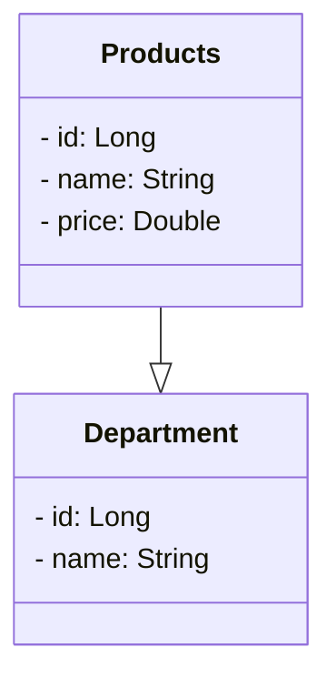

## API REST 
Disponibilizar uma APi REST com um endpoint /products onde é possível obter uma lista de produtos
com suas categorias.
Foi realizado um modelo de domínio utilizando um diagrama UML e disponibilizado em linguagem mermaide

### Conceitos abordados na construção da API
Arquitetura MVC
Spring Boot 3
JAVA 17
ORM
Mapeamento URLs - Endpoints
Serialização JSON
DTO
Exceptions

